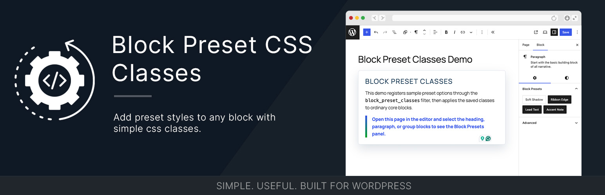

# Block Preset Classes


[](https://playground.wordpress.net/?blueprint-url=https://raw.githubusercontent.com/bob-moore/Block-Preset-Classes/main/_playground/blueprint-github.json)

Block styles are useful… until you need more than one.

By default, WordPress only lets you apply a single block style at a time. That means if you want combinations (padding + border + background), you end up creating a bunch of nearly identical styles just to cover every variation.

This plugin solves that.

What it does

Block Preset Classes lets you define reusable presets (CSS classes) and apply multiple of them to a block.

Instead of picking one style, you can stack presets and mix them however you want.

Under the hood, it simply adds those classes to the block’s Additional CSS Classes field — the same way block styles work, just without the one-style limit.

Why use it
	•	Avoid creating dozens of redundant block styles
	•	Mix and match design options freely
	•	Keep your CSS simple and scalable

How it works
	1.	Define your preset classes
	2.	Select them in the editor
	3.	Classes get added to the block

That’s it. No magic — just classes.

It provides:

- A REST endpoint that returns preset options per block name.
- A block editor panel that lets users toggle class presets on selected blocks.
- A JavaScript filter that allows dynamic, attribute-aware option mutation at runtime.

## Features

- Extends block editor behavior via `editor.BlockEdit` filter.
- Supports global and block-specific presets.
- Uses one REST request per editor load, then filters in JavaScript from cache.
- Supports dynamic option mutation in JS via `bmd.blockPresets.classOptions`.
- Accepts a clean internal PHP map format:
	- `block_name => [ label => value ]`

## Requirements

- WordPress 6.7 or later
- PHP 8.2 or later
- Node.js 18.12 or later (for local development/build)

## Installation

### As a WordPress plugin

1. Build production assets (`npm run build`).
2. Package the plugin (`npm run zip`) or zip the plugin directory.
3. In WordPress admin, go to Plugins > Add New Plugin > Upload Plugin.
4. Upload the ZIP and activate Block Preset Classes.

### As a Composer dependency

1. Require the package from your consuming plugin or theme.
2. Ensure Composer autoloading is active.
3. Instantiate and hook the plugin class in your bootstrap:

```php
<?php

use Bmd\BlockPresetClasses;

$plugin = new BlockPresetClasses(
    plugin_dir_url( __FILE__ ),
    plugin_dir_path( __FILE__ )
);

$plugin->mount();
```

## Registering Presets

Presets are provided in PHP through the `block_preset_classes` filter.

Example:

```php
<?php

add_filter( 'block_preset_classes', function( array $presets ): array {
		$presets['core/group'] = [
				'Red Background'  => 'has-preset-red-background',
				'Blue Background' => 'has-preset-blue-background',
		];

		$presets['core/paragraph'] = [
				'Small Caps' => 'has-preset-small-caps',
		];

		return $presets;
} );
```

Notes:

- If value does not start with `has-preset-`, it is normalized automatically.
- REST output is returned as `[{ label, value }]` arrays for JS consumption.

## JavaScript Runtime Mutation

You can dynamically adjust options based on block name and attributes:

```ts
addFilter(
	'bmd.blockPresets.classOptions',
	'my-plugin/block-preset-mutations',
	( options, blockName, blockAttributes ) => {
		if ( blockName === 'core/group' && blockAttributes?.layout?.type === 'flex' ) {
			return [
				...options,
				{ label: 'Reverse Mobile', value: 'has-preset-reverse-mobile' },
			];
		}

		return options;
	}
);
```

## REST Endpoint

- Route: `/wp-json/block-preset-classes/v2/all`
- Method: `GET`
- Auth: Public (permission callback returns true)

## Changelog

### 0.3.1

- Added PHPUnit coverage with WP_Mock.
- Added WordPress Playground demo content and sample preset registration.
- Added GitHub Actions lint, build, and PHP test workflow.

### 0.3.0

- Moved the GitHub updater into a scoped Composer dependency under `vendor/scoped`.
- Added `wpify/scoper` configuration and tracked scoped lock files for reproducible releases.
- Standardized release packaging on `npm run zip`.

### 0.2.1

- Added GitHub updater integration so plugin installs can detect new releases from this repository.
- Packaged release now includes the updater dependency installed from Composer.

### 0.2.0

- Added `BasicPlugin` interface (`inc/BasicPlugin.php`) with `mount()`, `setUrl()`, `setPath()`.
- Refactored `BlockPresetClasses` to implement `BasicPlugin` with injected URL and path.
- `buildPath` and `buildUrl` now pass through `block_preset_classes_plugin_path` / `block_preset_classes_plugin_url` filters for integrator overrides.
- Updated plugin bootstrap to a named function `create_block_preset_classes_plugin()`.
- Removed hardcoded `"version"` from `composer.json`; version is now read from git tags.

### 0.1.1

- Added `mount()` method to class that registers all WordPress hooks in one call
- Simplified plugin bootstrap: replaced individual `add_action`/`add_filter` calls with `$plugin->mount()`.
- When using the library via Composer, call `$plugin->mount()` after instantiation instead of wiring hooks manually.

### 0.1.0

- Initial Block Preset Classes release.
- Added REST-backed block preset options.
- Added block editor UI for toggling class presets.
- Added JavaScript filter support for runtime option mutations.

## License

GPL-2.0-or-later. See https://www.gnu.org/licenses/gpl-2.0.html.
